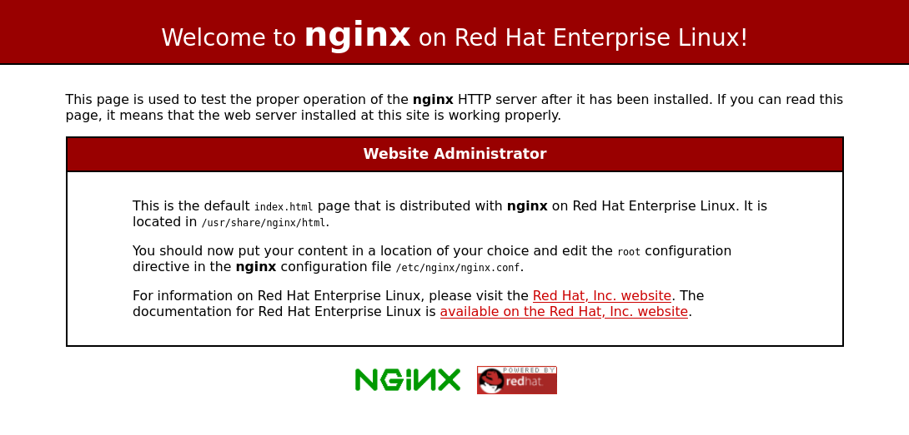

# Exercise 04 — Second Playbook


## Objective

In this exercise, students will extend a given sample playbook for adjusting firewall configuration to permit access to the web server. Again, use Ansible documentation to find module name and parameters.


## Content

    Exercise 04 - Second Playbook/
    ├── hosts
    ├── playbook.yml
    └── README.md


## Guidance

1.  Log in to the Ansible control node with your team user (`ansible0X`, `X` being your team number). IP and password will be provided by the instructor:

    ```shell
    ssh ansible0X@<control_node_IP_address>
    ```

2.  On the Ansible control node, change your working directory to `Exercise 04*/` in your user's home directory:

    ```shell
    cd ~/Exercise\ 04*
    ```

3.  Review the file `playbook.yml` and compare it with the playbook you had worked with during the previous exercise:

    ```shell
    cat playbook.yml
    ```

4.  Run the provided sample playbook and verify the result to ensure your managed host is in the correct state:

    ```shell
    ansible-playbook -i hosts playbook.yml
    ```

    Note that if you had successfully completed the previous exercise then no changes may have been made by running this playbook.

5.  Identify the public IP address of your managed host (on the '158.177.173.144/28' network). Log in to the host using it's name (`serverX-a`, `X` being your team number) and then use the `ip address` command to list all addresses. The public address starts with `158`...

    ```shell
    ssh root@serverX-a
    ip -4 -br address | grep 158
    exit
    ```

    Type the public IP address into your web browser and try to load the page. You are unable to connect — Linux firewall daemon is not accepting connections. You can confirm that Linux firewall daemon is running and view enabled ports and services with the following commands:

    ```shell
    ssh root@serverX-a
    systemctl status firewalld
    firewall-cmd --list-all
    exit
    ```

    Note that the HTTP service and associated port is not enabled.

6.  Use the `ansible-doc -l` CLI command to list all Ansible modules and find a module that allows managing firewall configuration. You can search within this list by typing <kbd>/</kbd>, followed by your search term (such as 'firewall' or 'firewalld'). Once you've found the correct module to manage arbitrary ports/services with Linux firewall daemon, use `ansible-doc <module name>` to view available options.

    ```shell
    ansible-doc -l
    ansible-doc <module name>
    ```

    Alternatively, you can use the [online documentation](https://docs.ansible.com/ansible/latest/collections/ansible/posix/#modules).

7.  Modify the sample playbook and add a new task with the identified module to modify firewall settings. Either enable the HTTP service (or port 80/TCP), or alternatively disable Linux firewall daemon altogether. You can achieve this goal in a variety of ways: choose the module which you're most comfortable with, refer to the documentation for details, and contact your instructor if you're stuck.

    ```shell
    vi playbook.yml
    ```

    Use the command `ansible-doc <module name>` to find the appropriate options of the selected module. Scroll down to the examples section to get an idea about the usage. Look for options to specify _ports_ or _services_ and their states. Also look for options to activate the changes _immediately_ and _permanently_.

    Remember the general syntax for tasks in a playbook, for example:

    ```yaml
    - name: Description of the task
      module_name:
        service: service_name
        next_option: next_value
        ...
    ```

8.  Re-run the modified playbook and, once successful, check firewall settings on your managed host:

    ```shell
    ansible-playbook -i hosts playbook.yml
    ssh root@serverX-a firewall-cmd --list-all
    ```

    Note that if the playbook ran successfully and firewall settings have not been applied (to services or ports) then check the options of the `firewalld` module for activating changes immediately. Re-run the playbook after making changes.

    Once firewall settings were changed on the managed host, re-load your browser tab with the public IP. You should now see the following web site:

    

9.  _Optional_: You could further extend the playbook. For example, you might want to add tasks to configure time synchronization on the managed host. For this, you would need to perform the following tasks. You can re-use (copy) many existing tasks in this playbook:

    1.  Install `chrony` package. The playbook already contains a package installation task, just copy, paste, and adjust it.

    2.  Modify `/etc/chrony.conf` to include the following line (`time.service.networklayer.com` being the NTP source):

        ```ini
        server time.service.networklayer.com iburst
        ```

        You can use the Ansible module `lineinfile` for this task, modifying the file `/etc/chrony.conf`, matching lines starting with the word `pool`, and replacing them with the line `server time.service.networklayer.com iburst`.

        For example, if you want to replace the line starting with 'foo' with a line 'bar' in file `myfile`, you can use the following task:

        ```yaml
        - name: replace foo with bar in myfile
          lineinfile:
            path: myfile
            regexp: "^foo"
            line: bar
            backup: yes
        ```

    3.  Start and enable the `chronyd` service, using the same module you had used previously for starting the `nginx` service.

    4.  Re-run the modified playbook.

    If the playbook ran successfully then check the time synchronization status on your managed host:

    ```shell
    ssh root@serverX-a
    systemctl status chronyd
    chronyc sources
    grep server /etc/chrony.conf
    exit
    ```

    _Important_: This is only a suggestion — if you have other scenarios in mind then please explore those instead! The goal is for you to become familiar with using the Ansible documentation to get a given job done.

10. 🎉 Congratulations, you've completed this exercise! 🎉

You may want to continue with the [next](../Exercise%2005%20-%20Variables) exercise.


## Reference Information

- [ansible.posix.firewalld – Manage arbitrary ports/services with firewalld](https://docs.ansible.com/ansible/latest/collections/ansible/posix/firewalld_module.html)
- [ansible.builtin.lineinfile – Manage lines in text files](https://docs.ansible.com/ansible/latest/collections/ansible/builtin/lineinfile_module.html)
