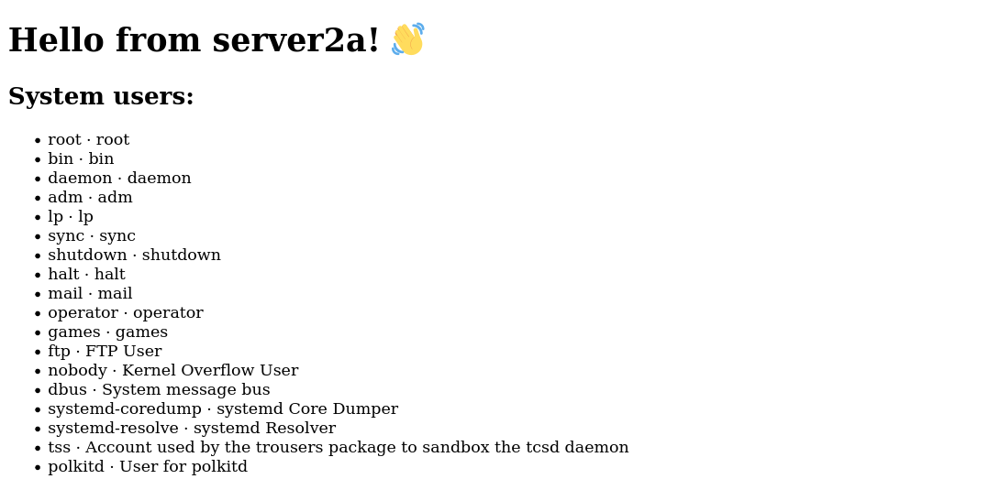

# Exercise 07 — Templates


## Objective

In this exercise, students will extend a given sample playbook to explore the Ansible `template` module.


## Content

    Exercise 07 - Templates/
    ├── hosts
    ├── index.html
    ├── playbook.yml
    └── README.md


## Guidance

1.  Log in to the Ansible control node with your team user (`ansible0X`, `X` being your team number). IP and password will be provided by the instructor:

    ```shell
    ssh ansible0X@<control_node_IP_address>
    ```

2.  On the Ansible control node, change your working directory to `Exercise 07*/` in your user's home directory:

    ```shell
    cd ~/Exercise\ 07*
    ```

3.  Review the file `playbook.yml`:

    ```shell
    cat playbook.yml
    ```

    Refer to the Ansible documentation (`ansible-doc`) to understand what each of the tasks does.

4.  Run the provided sample playbook, and subsequently connect to the public IP of your managed host using your web browser.

    ```shell
    ansible-playbook -i hosts playbook.yml
    ```

    If you don't know the public IP of your managed host then log in to your server and run `ip address` to find it. The public address starts with `158`... Also check that Linux firewall daemon permits access to the HTTP service (or port 80/TCP):

    ```shell
    ssh root@serverX-a "ip -4 -br address | grep 158"
    ssh root@serverX-a firewall-cmd --list-all
    ```

    _Hint_: You can also use Ansible to find the public IP of your managed host:

    ```shell
    ansible all -i hosts -u root -m setup -a 'filter=ansible_default_ipv4'
    ```

    After entering the public IP of your managed host into your web browser, you should now see the following web page:

    

5.  Make yourself familiar with the Ansible `template` module. While the `copy` module copies files from the Ansible control node to the managed host(s), the `template` module transforms the files while doing so. It uses [Jinja2 templating language](https://jinja.palletsprojects.com/en/2.11.x/templates/) for this purpose.

    Check the syntax of the `template` module and look for the examples at the bottom of the page.

    ```shell
    ansible-doc template
    ```

6.  Modify the sample playbook and replace the `copy` module with the `template` module for distributing the HTML document.

    Note that by convention, Jinja2 templates have a file name ending in `*.j2`. Hence, you may want to rename the source file `index.html` to `index.html.j2` to follow this convention; even though this is not strictly required:

    ```shell
    mv index.html index.html.j2
    ```

    Replace the `copy` module with the `template` module in your playbook. Do not forget to specify the correct source file. Consider creating a backup of the destination file using the appropriate task option.

    ```shell
    vi playbook.yml
    ```

    Re-run the modified playbook again to ensure that it still works. When re-loading your browser tab with the public IP the resulting web page should be unchanged.

    ```shell
    ansible-playbook -i hosts playbook.yml
    ```

7.  Now modify the template file `index.html.j2` and add a variable that dynamically adds content to the resulting file. You can replace an existing string (e.g. 'a server') with a variable expression: `{{ variable }}`. You can use pre-defined Ansible facts for this purpose, for example `{{ ansible_hostname }}`.

    ```shell
    vi index.html.j2
    ```

    For a list of all available facts run the following command:

    ```shell
    ansible all -i hosts -u root -m setup | less
    ```

    Use the [Jinja2 templating language](https://jinja.palletsprojects.com/en/2.11.x/templates/) documentation to learn more about variables in templates.

    Re-run the playbook after modifying the template, and then re-load your browser tab to verify if the changes were successful. After replacing the server name the web page might look like this:

    

8.  Modify the template file `index.html.j2` again and add in a loop to display a list variable that is defined in your playbook. The loop syntax is documented [here](https://jinja.palletsprojects.com/en/2.11.x/templates/#for):

    ```python
    
      {{ item }}
    
    ```

    In this example, `sequence` is an existing list variable. The loop will iterate over this list, and with each iteration `item` will contain the current list element.

    Add a simple HTML list which contains all elements of a variable `users` to the template file `index.html.j2`:

    ```html
    <ul>
      
      <li>{{ user }}</li>
      
    </ul>
    ```

    Add the list variable `users:` to your playbook (either `vars:`, or `vars_files: <filename>`). For example:

    ```yaml
    vars:
      users:
        - user1
        - user2
    ```

    Re-run the playbook after modifying the template, and then re-load your browser tab to verify if the changes were successful.

9.  Next, modify your playbook again to compute the `users` variable dynamically based on the users that are defined in your managed host. You could use the Ansible `getent` module to query the Linux passwd database (`database: passwd`) on your managed host. User information is subsequently stored in a variable named `getent_passwd`. To get information about the `getent` module use the command:

    ```shell
    ansible-doc getent
    ```

    The `getent` task has to be inserted before the template task.

    To show the content of this newly registered variable, add the following debug task to your playbook (after the `getent` task):

    ```yaml
    - debug:
        var: getent_passwd
    ```

    Finally, modify your template (`index.html.j2`) to iterate over the `getent_passwd` variable.

    Re-run the playbook. The resulting web page might look like this:

    

10. _Optional_: The variable `getent_passwd` is actually a dictionary object. When you iterate over the dictionary with a `` loop then you're iterating over the dictionary keys (user names), only. You can, however, use the following syntax to iterate over keys and values alike:

    ```python
    
      Key: {{ key }}
      Value: {{ value }}
    
    ```

    Modify the template (`index.html.j2`) to iterate over key and value. The `value` is a list and you can select a particular element by specifying the element's index, such as `value[3]` (which contains the user's comment). Try to produce the following output:

    

11. 🎉 Congratulations, you've completed this exercise! 🎉

You may want to continue with the [next](../Exercise%2008%20-%20Parallelism) exercise.


## Reference Information

- [ansible.builtin.copy – Copy files to remote locations](https://docs.ansible.com/ansible/latest/collections/ansible/builtin/copy_module.html)
- [ansible.builtin.template – Template a file out to a target host](https://docs.ansible.com/ansible/latest/collections/ansible/builtin/template_module.html)
- [Jinja2 templating language](https://jinja.palletsprojects.com/en/2.11.x/templates/)
- [ansible.builtin.getent – A wrapper to the unix getent utility](https://docs.ansible.com/ansible/latest/collections/ansible/builtin/getent_module.html)
